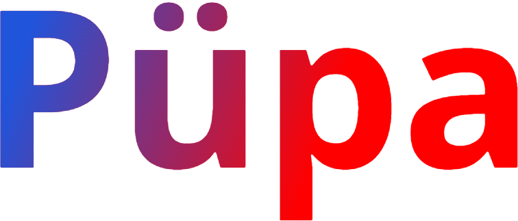



# Kuidas seda käivitada

1.Samm
Laadige alla Node package manager'it
2.Samm
Avage "client" kausta terminalis ja kirjutage "npm install" ja seepärast "npm start"
3.Samm
Avage kausta "server" IDE's (Näiteks IntelliJ IDEA) ja käivitage "ServerApplication.java"
4.Samm
Naudige!

# 1. Projekti eesmärk

Projekti eesmärk - veebirakenduse(veebisaiti) arendamine, mille abil kasutajat saavad luua kõiksuguseid mänge/ülesanndeid(edaspidi kaardid). Kasutajale, kes loob kaarte(edaspidi õpetaja) on saadaval mitu kaardi maketti, näiteks "vali õige vastus" või "leia paari", kuhu ta ise saab lisada ülesannete tingumusi ja vastuste võimalusi, märkida õiget/valet varianti. Kaadrid, omakorda, saab lisada komplektidesse, et pleks võimalus pikkemateks sessioonideks ilma pideva ringiliikumise. Kasutajale, kes lahendab kaarte(edaspidi õpilane), peale harjutuste lõppetamist väljundatakse tema isiklik tulemus: läbimise protsent ja lahendamise kiirus. Samas peab olema ka automaatne ristsõna loomise võimalus, kus õpetajalt nõudakse ainult vajaliku sõna lisamist, ristsõna ise luuakse automaatselt.

# 2. Projekti põhjus

Projekt on loodud Tallinna Ülikooli Digitehnoloogi Instituudi(https://www.tlu.ee/dt) tarkvaraarenduse projekti raames, kliendi(Gerly Lehtmets) poolt, selleks, et abistada õpetajaid oma koolis.

# 3. Kasutatud tehnoloogiad

Figma
Trello
Discord
Visual Studio Code
IntelliJ IDEA 2022.1.2
ReactJS
Node.Js
PostGRE
Heroku

# 4. Projekti Autorid

Daniil Šarin
Karen Tihhomirov
Daniil Stoljar
Ilja Leontjev
 

# 3. Projekti kirjeldus

Rakendus koosneb järgmistest blokkidest:

1. Registreerimine, autentimine ja sisselogimine
2. Õpetaja funktsionaalsus
3. Õpilase funktsionaalsus

## 3.1 Kasutajate tüübid

Rakenduses on ettenähtud kaks tüüpi kasutajaid: õpetaja ja õpilane. Õpetaja loob kaarte, saab neid teha avatuks/suletuks, samamoodi ka pakkidega, läbivaadata õpilase lahendusi. Õpilane valib kaarte, mis on talle saadavad, lahendab neid, saab oma tulemust ja isiklikut statistikat vaadata.

## 3.2 Registreerimine

Registreerimiseks kasutaja peab sisestama:

1. Nimi ja perekonnanimi
2. email
3. Salasõna

## 3.3 Õpetaja ja õpilase sisselogimine

Esialgses rakenduse versioonis, kohe peale sisselogimist kasutajalt küsitakse tema roll: õpetaja või õpilane. Funktsionaalsus, mida talle pakkutakse, on seotud rolliga, mida ta valib. 
Kasutajal peab olema realiseeritud unustatud salasõna taastamise võimalus. Salasõna taastamise nõudmisel on vajalik saata email´i peale link, mille abil saab salasõna taastada.

## 3.4 Õpetaja funktsionaalsus
Peale sisselogimist ja rolli valimist "Õpetaja" saab läbipääsu järgmisele funktsionaalile:

1. Kaardide ja kaardi pakkide loomine
2. Loodud/avaliku kaarte ja pakkide läbivaatamine
3. Valmistatud harjutuste redakteerimine: sisu muutumine, ühest pakkist teisse ülekandmine, staatuse muutmine(avalik/suletud)
4. Loodud ülesannete lahendamine statistika ülevaade
5. Harjutuste väljaprintimine, millel on tüüp "ristsõna"
6. Kaardide väljaprintimine, selleks, et kasutada neid kontakttunnis

## 3.5 Õpilase funktsionaalsus

Peale sisselogimist ja rolli valimist "Õpilane" saab läbipääsu järgmisele funktsionaalile:

1. Ülevaade kaardidest, mis on saadaval
2. Pakkide infost ülevaade
3. Ülesannete lahendamine
4. Oma lahendatud ülesannetest statistika ülevaade

## 5.5 Vertabelo andmebaasi arhitektuur

# LICENSE

Copyright (c) <2022> <Daniil Šarin, Karen Tihomirov, Daniil Stoljar, Ilja Leontjev>

Permission is hereby granted, free of charge, to any person obtaining a copy
of this software and associated documentation files (the "Software"), to deal
in the Software without restriction, including without limitation the rights
to use, copy, modify, merge, publish, distribute, sublicense, and/or sell
copies of the Software, and to permit persons to whom the Software is
furnished to do so, subject to the following conditions:

The above copyright notice and this permission notice shall be included in all
copies or substantial portions of the Software.

THE SOFTWARE IS PROVIDED "AS IS", WITHOUT WARRANTY OF ANY KIND, EXPRESS OR
IMPLIED, INCLUDING BUT NOT LIMITED TO THE WARRANTIES OF MERCHANTABILITY,
FITNESS FOR A PARTICULAR PURPOSE AND NONINFRINGEMENT. IN NO EVENT SHALL THE
AUTHORS OR COPYRIGHT HOLDERS BE LIABLE FOR ANY CLAIM, DAMAGES OR OTHER
LIABILITY, WHETHER IN AN ACTION OF CONTRACT, TORT OR OTHERWISE, ARISING FROM,
OUT OF OR IN CONNECTION WITH THE SOFTWARE OR THE USE OR OTHER DEALINGS IN THE
SOFTWARE.